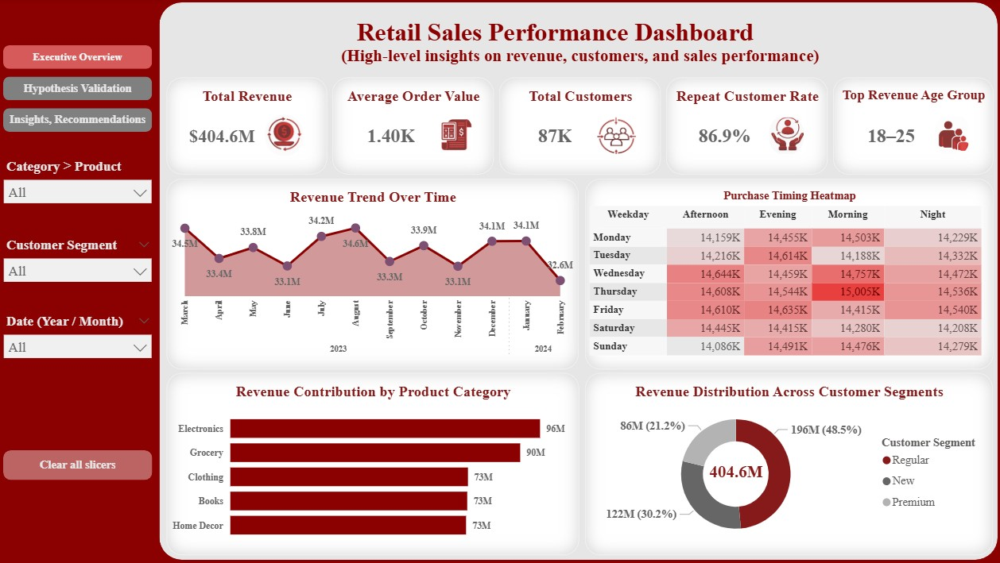
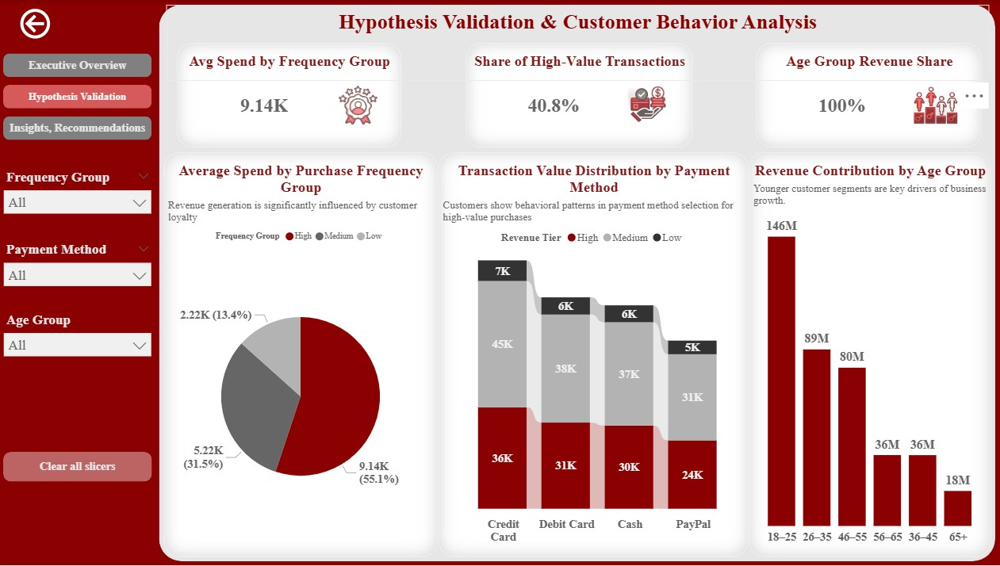
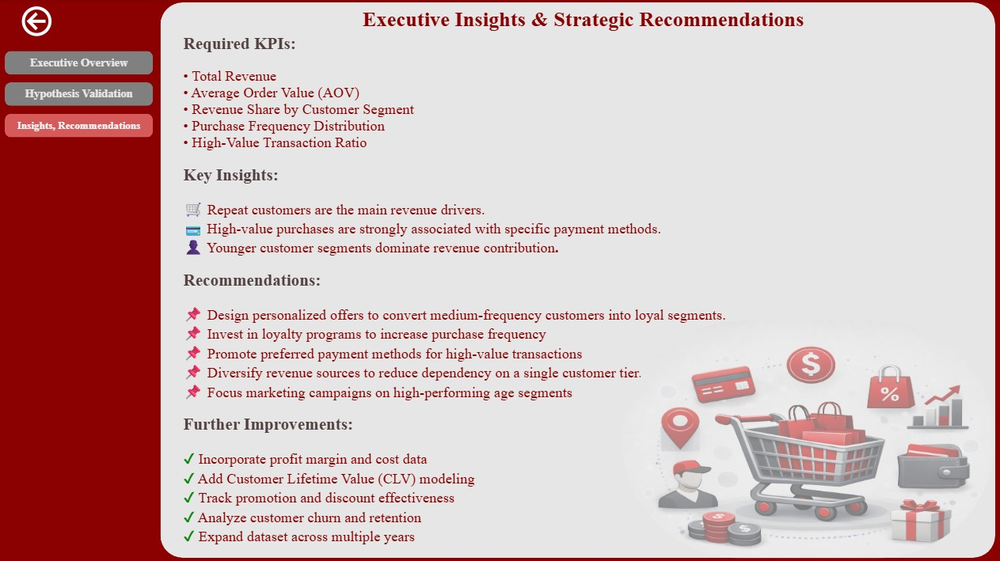

# 📊 Retail Sales Performance Analysis: Customer Behavior & Revenue Insights

## 📌 Project Overview

This project analyzes retail transactional data to uncover sales patterns, customer behavior, and revenue drivers. The goal is to provide actionable insights that support data-driven decision-making for sales strategy, inventory planning, and business growth.

The analysis focuses on understanding how customers, products, and time-based factors influence overall retail performance.

## 🎯 Business Context

Retail businesses generate large volumes of transactional data, but without proper analysis, valuable insights often remain hidden. This project aims to bridge that gap by transforming raw transaction data into meaningful business intelligence.

The insights from this analysis can help decision-makers:
- Identify high-value customers
- Detect sales trends and seasonality
- Optimize product and pricing strategies
- Improve inventory and promotional planning

## 👤 Primary Stakeholder
 Head of Sales & Business Analytics at a mid-sized retail company operating in Germany.

**Stakeholder Objectives:**
- Increase total revenue and average transaction value
- Understand customer purchasing behavior
- Identify top-performing products
- Improve sales planning using data-driven insights

## 🧮 Dataset
- **Source:** [Kaggle - Retail Transactional Dataset](https://www.kaggle.com/datasets/bhavikjikadara/retail-transactional-dataset/data)
- **Type:** Transaction-level retail data
- **Granularity:** Individual sales transactions
  
## 🗂️ Project Structure
 ```text
 ├── Data/
 │   └── Retail_Transactions.csv
 ├── Images/
 │   ├── 1.dashboard_overview.jpg
 │   ├── 2.dashboard_hypothesis_validation.jpg
 │   └── 3.dashboard_insights_recommendations.jpg
 ├── Notebooks/
 │   └── Retail_Sales_EDA.ipynb
 ├── Power_BI_Dashboard/
 │   └── Retail_Sales_Dashboard.pbix
 ├── Presentation
 │   └── Retail_Sales_Presentation.pptx
 ├── README.md
 └── requirements.txt
```
## 🔍 Analysis Workflow
The project follows a structured data analytics workflow:
- Data understanding and Quality Checks
- Feature engineering
- Exploratory Data Analysis (EDA)
- Hypothesis-Driven Analysis
- Business Recommendations
- Further Improvements

## ❓ Key Business Questions
- Do frequent customers generate more revenue than occasional buyers?
- Do certain payment methods tend to be used by high-value transactions more frequently,indicating that customers prefer specific payment methods for larger purchases? 
- Which customer age groups contribute most to total revenue?

## 🛠️ Tools & Technologies
- Python (Pandas, Matplotlib, Seaborn)
- Jupyter Notebook
- Power BI
- Git & GitHub

## 📊 Power BI Dashboard

The Power BI dashboard consists of three interactive pages designed to support business decision-making and hypothesis validation.

### 1️⃣ Executive Overview


This page provides a high-level overview of key business KPIs, revenue trends over time, and customer distribution. It allows stakeholders to quickly understand overall performance and identify major patterns.

### 2️⃣ Hypothesis Validation


This page focuses on validating business hypotheses related to customer behavior, age groups, purchase frequency, and payment methods. Interactive filters enable users to explore how different segments impact revenue and performance metrics.

### 3️⃣ Insights & Recommendations


This page summarizes the most important analytical findings and translates them into actionable business recommendations to support data-driven strategic decisions.

## 🚀 Project Status
Final project includes complete EDA, insights, and Power BI dashboards providing actionable recommendations for business stakeholders
